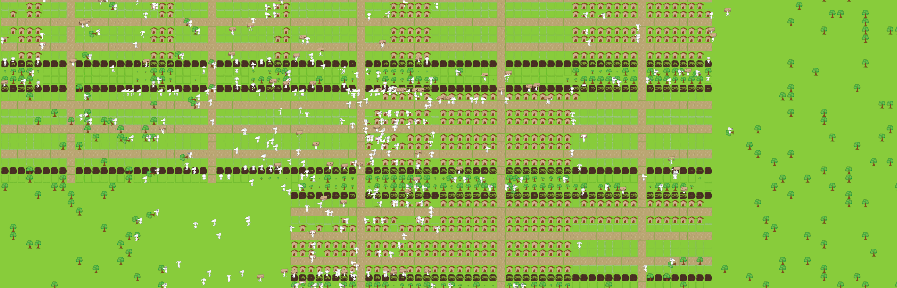

# The Population Must Grow
Simple simulation game to build up an ever growing population.

Released on steam https://store.steampowered.com/app/3820960. See steam store page to more info about the game.

## Requirements to build
- Zig 
    - https://ziglang.org/
- steam SDK
    - account required
    - https://partner.steamgames.com/downloads/list
    - could be removed in the code with a little bit of work. Only used for steam achievements
    - location hard coded in build.zig. Replace with your own path
    - manual need to acquire steam_api64.dll when using windows. Found in steam sdk. Needs to be copied to dependency folder.
- vulkan Graphics API
    - when activating validation layer, sdk is required: https://vulkan.lunarg.com/
    - location hard coded in build.zig. Replace with your own path

## build and run
`zig build run`

## run tests
`zig build test`

## cross compile 
- linux build
  - `zig build -Dtarget=x86_64-linux-gnu`

## other helpful commands i used 
### steam upload
`tools\ContentBuilder\builder\steamcmd.exe +login <account_name> +run_app_build ..\scripts\thePopulationMustGrow.vdf +quit`

### valgrind
`valgrind --leak-check=full --show-leak-kinds=all <your program here>`

`valgrind --leak-check=full --show-leak-kinds=all --suppressions=val_sup.txt <your program here>`

## vulkan feature support page
https://vulkan.gpuinfo.org/listfeaturescore10.php?platform=windows

